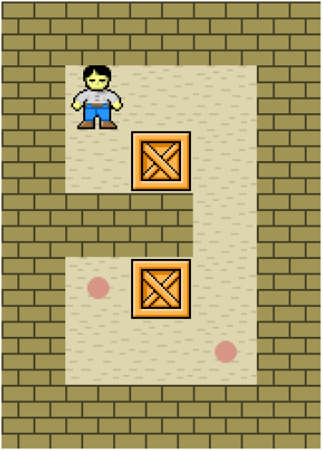

# C++ Console Application To Solve Sokoban Game Using Q-Learning Algorithm
## Description:
 <br>
Sokoban is a game where the player moves boxes to their storage location. The game ends when all the boxes are in storage locations or a deadlock happens when it's impossible to solve the game.
## Solution:
I used Q-Learning algorithm that keeps iterating and finding the best moves from any cell until finishing the game successfully. The application accepts any kind of grids and asks the user to place the player in an empty cell, then prints the states of the best moves.<br>
Note that it might take some seconds to show the output because it will be learning the grid.
## Grid Keys:
* 0 -> Empty cell
* 1 -> Wall
* 2 -> Box
* 3 -> Storage location
* 4 -> Box in the storage location
* 5 -> Player
## Output:
```
1 1 1 1 1 
1 0 0 0 1 
1 0 2 0 1 
1 1 1 0 1 
1 3 2 0 1 
1 0 0 3 1 
1 1 1 1 1 

Choose a valid position(X Y): 1 1
***********************************
1 1 1 1 1 
1 5 0 0 1
1 0 2 0 1
1 1 1 0 1
1 3 2 0 1
1 0 0 3 1
1 1 1 1 1

1 1 1 1 1
1 0 0 0 1
1 5 2 0 1
1 1 1 0 1
1 3 2 0 1
1 0 0 3 1
1 1 1 1 1

1 1 1 1 1
1 0 0 0 1
1 0 5 2 1 
1 1 1 0 1
1 3 2 0 1
1 0 0 3 1
1 1 1 1 1

1 1 1 1 1
1 0 5 0 1
1 0 0 2 1
1 1 1 0 1
1 3 2 0 1
1 0 0 3 1
1 1 1 1 1

1 1 1 1 1
1 0 0 5 1 
1 0 0 2 1
1 1 1 0 1
1 3 2 0 1
1 0 0 3 1
1 1 1 1 1

1 1 1 1 1
1 0 0 0 1
1 0 0 5 1
1 1 1 2 1
1 3 2 0 1
1 0 0 3 1
1 1 1 1 1

1 1 1 1 1
1 0 0 0 1 
1 0 0 0 1
1 1 1 5 1
1 3 2 2 1
1 0 0 3 1
1 1 1 1 1

1 1 1 1 1
1 0 0 0 1
1 0 0 0 1
1 1 1 0 1
1 3 2 5 1
1 0 0 4 1
1 1 1 1 1

1 1 1 1 1
1 0 0 0 1
1 0 0 0 1
1 1 1 0 1
1 4 5 0 1
1 0 0 4 1
1 1 1 1 1
```
